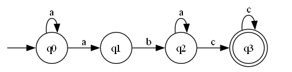
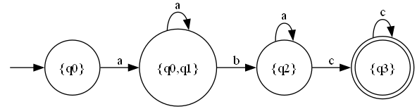

# Topic: Determinism in Finite Automata. Conversion from NDFA 2 DFA. Chomsky Hierarchy.

### Course: Formal Languages & Finite Automata
### Author: Gabriela Pricop

---

## Theory

A finite automaton (FA) is an abstract machine used to recognize patterns within input strings. It can be compared to a state machine as they both have similar structures and purpose. The word *finite* signifies the fact that an automaton has a finite number of states. Formally, a deterministic finite automaton (DFA) is defined as a 5‑tuple $(Q, \Sigma, \delta, q_0, F)$ where:

- $Q$ is a finite set of states,
- $\Sigma$ is the input alphabet,
- $\delta: Q \times \Sigma \to Q$ is the transition function (for a DFA it gives exactly one next state),
- $q_0 \in Q$ is the initial state,
- $F \subseteq Q$ is the set of accepting (final) states.

A nondeterministic finite automaton (NFA) differs in that $\delta: Q \times (\Sigma \cup \{\lambda\}) \to 2^Q$ may lead to several states or none, and may include $\lambda$-transitions (spontaneous moves). Both types accept exactly the class of regular languages.

Based on the structure of an automaton, there are cases in which with one transition multiple states can be reached, which causes non‑determinism to appear. In general, when talking about systems theory, the word *determinism* characterizes how predictable a system is. If there are random variables involved, the system becomes stochastic or non‑deterministic. That being said, automata can be classified as non‑deterministic, and there is in fact a possibility to reach determinism by following algorithms which modify the structure of the automaton.

**Subset Construction** (also called the powerset construction) is the standard algorithm for converting an NFA to an equivalent DFA. In this algorithm, each state of the DFA is a set of NFA states. Starting from the set containing the initial NFA state, for each input symbol we compute the set of all NFA states reachable from any state in the current set. If a new set appears, it becomes a new DFA state. The process repeats until no new sets are generated. A DFA state is final if it contains at least one final NFA state.

Finite automata are intimately related to **regular grammars** (Type‑3 in the Chomsky hierarchy). A regular grammar has productions of the form $A \to aB$ or $A \to a$ where $A,B$ are nonterminals and $a$ is a terminal. Given a DFA, we can construct an equivalent regular grammar by:
- Taking the states as nonterminals,
- Taking the alphabet as terminals,
- For each transition $\delta(q, a) = p$ adding the production $q \to a p$,
- If $p$ is a final state, also adding $q \to a$ (allowing termination),
- Setting the start symbol to the initial state.

The **Chomsky hierarchy** classifies grammars into four types:
- Type‑0 (recursively enumerable) – no restrictions on productions.
- Type‑1 (context‑sensitive) – productions of the form $\alpha A\beta \to \alpha\gamma\beta$.
- Type‑2 (context‑free) – productions $A \to \gamma$.
- Type‑3 (regular) – productions $A \to aB$ or $A \to a$.

The grammar obtained from a finite automaton is always regular, i.e., Type‑3.

---

## Objectives

1. Understand what an automaton is and what it can be used for.

2. Continuing the work in the same repository and the same project, the following need to be added:  
   a. Provide a function in your grammar type/class that could classify the grammar based on Chomsky hierarchy.  
   b. For this you can use the variant from the previous lab.

3. According to your variant number (by universal convention it is register ID), get the finite automaton definition and do the following tasks:  
   a. Implement conversion of a finite automaton to a regular grammar.  
   b. Determine whether your FA is deterministic or non‑deterministic.  
   c. Implement some functionality that would convert an NDFA to a DFA.  
   d. Represent the finite automaton graphically (Optional, bonus).

---

## Implementation Description

The solution is implemented in C# and consists of two main classes: `FiniteAutomaton` and `Grammar`. The `FiniteAutomaton` class encapsulates the components of an FA and provides methods for checking determinism, converting to a regular grammar, converting to a DFA (subset construction), and generating a graphical representation using Graphviz. The `Grammar` class represents a regular grammar and includes a method to classify the grammar according to the Chomsky hierarchy.

### Grammar Class and Classification

The `Grammar` class stores non‑terminals, terminals, production rules, and a start symbol. The method `ClassifyGrammar()` analyzes the productions and returns the most restrictive type in the Chomsky hierarchy. The logic follows the definitions:

- **Type 3 (Regular)**: All productions are of the form $A \to aB$ or $A \to a$ (right‑linear) or $A \to Ba$ or $A \to a$ (left‑linear). The implementation checks that each rule’s right‑hand side has length 1 (must be a terminal) or length 2 (either terminal+nonterminal or nonterminal+terminal). If any rule violates this, it is not regular.
- **Type 2 (Context‑Free)**: All productions have a single non‑terminal on the left‑hand side. If any left side is longer than one symbol, it is not context‑free.
- **Type 1 (Context‑Sensitive)**: For every rule, the length of the right‑hand side must be at least the length of the left‑hand side (non‑contracting). Additionally, rules may have context on the left.
- **Type 0 (Unrestricted)**: No restrictions.

Below is a simplified snippet of the classification method:

```csharp
public string ClassifyGrammar()
{
    bool isRegular = true;
    bool isContextFree = true;
    bool isContextSensitive = true;

    foreach (var lhs in productions.Keys)
    {
        // Check left-hand side: for CFG, it must be a single nonterminal
        if (lhs.Length != 1 || !nonTerminals.Contains(lhs))
            isContextFree = false;

        foreach (var rhs in productions[lhs])
        {
            // Regular grammar check
            if (rhs.Length == 1)
            {
                if (!terminals.Contains(rhs))
                    isRegular = false;
            }
            else if (rhs.Length == 2)
            {
                char first = rhs[0];
                char second = rhs[1];
                bool firstIsTerminal = terminals.Contains(first.ToString());
                bool secondIsNonTerminal = nonTerminals.Contains(second.ToString());
                bool firstIsNonTerminal = nonTerminals.Contains(first.ToString());
                bool secondIsTerminal = terminals.Contains(second.ToString());

                if (!(firstIsTerminal && secondIsNonTerminal) && !(firstIsNonTerminal && secondIsTerminal))
                    isRegular = false;
            }
            else
            {
                isRegular = false;
            }

            // Context-sensitive: |RHS| >= |LHS|
            if (rhs.Length < lhs.Length)
                isContextSensitive = false;
        }
    }

    if (isRegular) return "Type 3 (Regular)";
    if (isContextFree) return "Type 2 (Context-Free)";
    if (isContextSensitive) return "Type 1 (Context-Sensitive)";
    return "Type 0 (Recursively Enumerable)";
}
```

### FiniteAutomaton Class – Key Methods

#### a. Conversion to Regular Grammar

The method `ToRegularGrammar()` constructs a regular grammar from the FA. It uses the states as non‑terminals, the alphabet as terminals, and creates productions for each transition. For every transition $state \xrightarrow{symbol} dest$, we add a production $state \to symbol\; dest$. If $dest$ is a final state, we also add a production $state \to symbol$ to allow the derivation to terminate.

```csharp
public Grammar ToRegularGrammar()
{
    var vn = new HashSet<string>(states);
    var vt = new HashSet<string>(alphabet);
    var productions = new Dictionary<string, List<string>>();

    foreach (var state in transitions)
        foreach (var symbol in state.Value)
            foreach (var dest in symbol.Value)
            {
                if (!productions.ContainsKey(state.Key))
                    productions[state.Key] = new List<string>();
                productions[state.Key].Add(symbol.Key + dest);
                if (finalStates.Contains(dest))
                    productions[state.Key].Add(symbol.Key);
            }

    return new Grammar(vn, vt, productions, initialState);
}
```

#### b. Determinism Check

The method `IsDeterministic()` simply checks whether any state has more than one transition on the same input symbol. If such a case exists, the FA is non‑deterministic.

```csharp
public bool IsDeterministic()
{
    foreach (var state in transitions.Keys)
        foreach (var symbol in transitions[state].Keys)
            if (transitions[state][symbol].Count > 1)
                return false;
    return true;
}
```

#### c. NFA to DFA Conversion (Subset Construction)

The method `ToDFA()` implements the subset construction. It builds new DFA states as sets of NFA states, renames them, and determines final states. The core loop processes each DFA state (a set of NFA states) and computes for each input symbol the set of reachable NFA states. If a new set is found, it becomes a new DFA state.

```csharp
public FiniteAutomaton ToDFA()
{
    var start = new HashSet<string> { initialState };
    var dfaStates = new List<HashSet<string>> { start };
    var queue = new Queue<HashSet<string>>();
    queue.Enqueue(start);

    var dfaTransitions = new Dictionary<string, Dictionary<string, HashSet<string>>>();

    while (queue.Count > 0)
    {
        var current = queue.Dequeue();
        string currentName = string.Join(",", current.OrderBy(s => s));
        if (!dfaTransitions.ContainsKey(currentName))
            dfaTransitions[currentName] = new Dictionary<string, HashSet<string>>();

        foreach (var symbol in alphabet)
        {
            var next = new HashSet<string>();
            foreach (var state in current)
                if (transitions.ContainsKey(state) && transitions[state].ContainsKey(symbol))
                    next.UnionWith(transitions[state][symbol]);

            if (next.Count > 0)
            {
                string nextName = string.Join(",", next.OrderBy(s => s));
                dfaTransitions[currentName][symbol] = new HashSet<string> { nextName };
                if (!dfaStates.Any(s => s.SetEquals(next)))
                {
                    dfaStates.Add(next);
                    queue.Enqueue(next);
                }
            }
        }
    }
}
```

After constructing the sets, each DFA state is given a name like `"{q0,q1}"` and final states are those sets that contain at least one original final state.

#### d. Graphical Representation (Optional)

The method `GenerateGraph(string filename)` writes a `.dot` file describing the automaton and invokes Graphviz to produce a PNG image. This provides a visual representation of the automaton structure.

```csharp
public void GenerateGraph(string filename)
{
    using (StreamWriter writer = new StreamWriter(filename + ".dot"))
    {
        writer.WriteLine("digraph FA {");
        writer.WriteLine("rankdir=LR;");
        writer.WriteLine("node [shape = doublecircle];");
        foreach (var f in finalStates)
            writer.WriteLine($"{f};");
        writer.WriteLine("node [shape = circle];");
        writer.WriteLine($"start [shape=none,label=\"\"];");
        writer.WriteLine($"start -> {initialState};");
        foreach (var state in transitions)
            foreach (var symbol in state.Value)
                foreach (var dest in symbol.Value)
                    writer.WriteLine($"{state.Key} -> {dest} [label=\"{symbol.Key}\"];");
        writer.WriteLine("}");
    }
}
```

### Program Entry Point (Variant 21)

The main method constructs the FA for variant 21, tests determinism, converts to grammar, converts to DFA, and generates graphs.

```csharp
static void Main()
{
    var states = new HashSet<string> { "q0", "q1", "q2", "q3" };
    var alphabet = new HashSet<string> { "a", "b", "c" };
    var finalStates = new HashSet<string> { "q3" };
    string startState = "q0";

    var transitions = new Dictionary<string, Dictionary<string, HashSet<string>>>
    {
        { "q0", new Dictionary<string, HashSet<string>> { { "a", new HashSet<string> { "q0", "q1" } } } },
        { "q1", new Dictionary<string, HashSet<string>> { { "b", new HashSet<string> { "q2" } } } },
        { "q2", new Dictionary<string, HashSet<string>> { { "a", new HashSet<string> { "q2" } }, { "c", new HashSet<string> { "q3" } } } },
        { "q3", new Dictionary<string, HashSet<string>> { { "c", new HashSet<string> { "q3" } } } }
    };

    var fa = new FiniteAutomaton(states, alphabet, transitions, startState, finalStates);

    Console.WriteLine("Is Deterministic? " + fa.IsDeterministic());

    var grammar = fa.ToRegularGrammar();
    grammar.PrintGrammar();

    var dfa = fa.ToDFA();
    Console.WriteLine("DFA Deterministic? " + dfa.IsDeterministic());

    fa.GenerateGraph("nfa_variant21");
    dfa.GenerateGraph("dfa_variant21");

    Console.ReadKey();
}
```

---

## Conclusions / Screenshots / Results

- The original automaton (variant 21) was found to be **non‑deterministic** because state $q_0$ has two outgoing transitions on symbol $a$ (to $q_0$ and $q_1$).  
- A regular grammar was successfully derived from the NFA. The grammar’s productions faithfully reflect the transitions and final states.  
- Using the subset construction, the NFA was converted to an equivalent DFA. The DFA has states that are sets of the original NFA states, e.g., `"{q0}"`, `"{q0,q1}"`, `"{q2}"`, `"{q3}"`, etc. The conversion preserved the language, and the resulting DFA is deterministic.  
- The grammar obtained from the FA was classified as **Type 3 (Regular)** according to the Chomsky hierarchy, confirming the theoretical expectation.  
- Graphical representations were generated using Graphviz, providing clear visualisations of both automata. The images are shown below:

| Original NFA | Converted DFA |
|--------------|---------------|
|  |  |


The results demonstrate the successful implementation of the required conversions and confirm the theoretical relationships between finite automata and regular grammars.

---

## References

1. COJUHARI, I.; DUCA, L.; FIODOROV, I. *Formal Languages and Finite Automata – Guide for practical lessons*. Technical University of Moldova, 2022.  
2. Graphviz – Graph Visualization Software. https://graphviz.org/